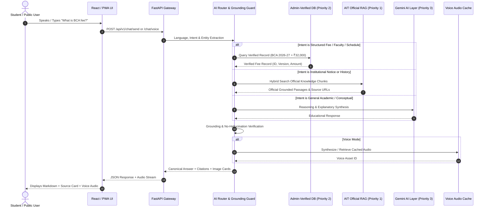
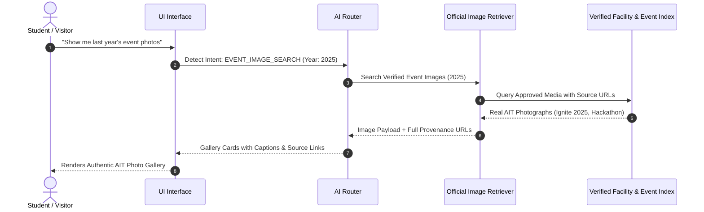
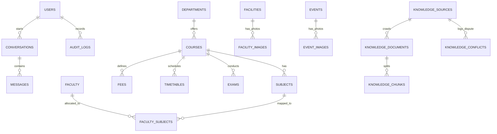

# AIT College AI Assistant — System Architecture & UML Documentation

This document contains architectural diagrams and UML specifications for Ahmedabad Institute of Technology's AI Assistant in alignment with the PRD.

---

## 1. System Architecture Diagram

```mermaid
graph TD
    subgraph Client Layer
        A1[Web Browser / Desktop]
        A2[Mobile / Tablet PWA]
        A3[Voice Microphone & Audio Player]
    end

    subgraph Gateway & Security
        B1[Nginx Reverse Proxy]
        B2[FastAPI Gateway / CORS / Rate Limiter]
        B3[JWT Auth & RBAC Security Layer]
    end

    subgraph AI & Orchestration Layer
        C1[AI Router]
        C2[Intent & Entity Classifier]
        C3[Source Authority Resolver]
        C4[Grounding & Hallucination Guard]
    end

    subgraph Knowledge & Truth Engines
        D1[(PostgreSQL Database - Operational Truth)]
        D2[pgvector & Hybrid RAG Engine]
        D3[Official AIT Image Registry with Provenance]
        D4[Gemini 1.5 Flash / Local AI Engine]
    end

    subgraph Background Services
        E1[AIT Portal Web Crawler: aitindia.in]
        E2[Audio Cache & Voice Synthesis]
        E3[ML Training & Rollback Registry]
        E4[Audit & Metrics Logger]
    end

    Client Layer --> Gateway & Security
    Gateway & Security --> AI & Orchestration Layer
    AI & Orchestration Layer --> Knowledge & Truth Engines
    Knowledge & Truth Engines --> Background Services
```

---

## 2. Sequence Diagram: Student Text & Voice Query



---

## 3. Sequence Diagram: Visual Media & Event Photo Retrieval



---

## 4. Entity-Relationship (ER) Diagram


